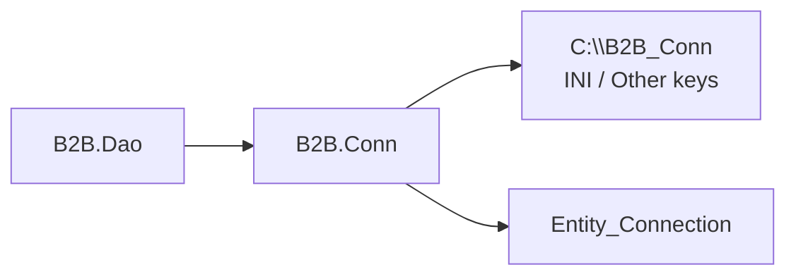
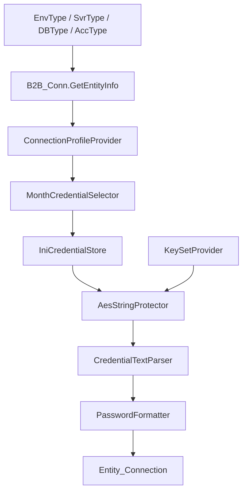

# B2B.Conn

`B2B.Conn` 負責還原與封裝原 AWS 離線環境使用的 B2B 連線資訊解析流程。此專案會依照環境別、服務類型、資料庫類型與帳號類型，讀取外部 INI 與金鑰檔，解密後回傳 Oracle 連線所需資訊。

## 專案定位



目前主要由 `B2B.Dao` 間接使用。其他專案不需要直接讀取 Oracle 帳密或組合連線字串。

## 主要內容

| 路徑 | 說明 |
| --- | --- |
| `B2B_Conn.cs` | 對外 facade，保留 `GetEntityInfo` 與 `CommConnString` 呼叫方式 |
| `Configuration/` | 連線設定檔、預設 profile 與文字正規化 |
| `Credentials/` | INI 讀取、月份帳密選擇、帳密解析、密碼格式化、Oracle 字串格式化 |
| `Cryptography/` | RSA、AES、SHA512、金鑰讀取與對稱金鑰處理 |
| `Models/` | 連線資訊、KeySet、RSA 與對稱金鑰模型 |
| `Modules/` | Autofac Module |
| `Options/` | `B2BConnOptions`，定義檔案路徑與解析設定 |

## 是否使用 Module

有。此專案使用 Autofac Module。

| Module | 位置 | 用途 |
| --- | --- | --- |
| `B2BConnModule` | `Modules/B2BConnModule.cs` | 註冊 `B2B_Conn` facade 與連線解析、INI、加解密相關服務 |

## Module 使用方式

通常不需要在 WebApi 直接註冊 `B2BConnModule`，因為 `B2BDaoModule` 已經會引入它：

```csharp
builder.RegisterModule<B2BConnModule>();
```

如果其他 Host 需要單獨使用 `B2B.Conn`，可自行註冊：

```csharp
var builder = new ContainerBuilder();
builder.RegisterModule(new B2BConnModule());
```

也可傳入自訂 Options：

```csharp
var options = new B2BConnOptions
{
    RootDirectory = @"C:\B2B_Conn"
};

builder.RegisterModule(new B2BConnModule(options));
```

## 對外使用方式

直接建立 facade：

```csharp
using B2B_Conn;

using var conn = new B2B_Conn();
var entity = conn.GetEntityInfo("DEV", "API", "B2B", "APP");
```

透過 DI 使用：

```csharp
public sealed class MyService(B2B_Conn.B2B_Conn b2bConn)
{
    public Entity_Connection GetConnection()
    {
        return b2bConn.GetEntityInfo("DEV", "API", "B2B", "APP");
    }
}
```

## 解析流程



## 外部檔案需求

```text
C:\B2B_Conn
├─ B2BConn1.ini
├─ B2BConn2.ini
└─ Other
   └─ 解密所需 Key / IV / RSA 相關檔案
```

這些檔案屬於環境機密，不應提交到 Git。部署時必須由執行環境提供。

## 回傳資料

`GetEntityInfo` 會回傳 `Entity_Connection`，提供 DAO 組合連線字串所需欄位：

| 欄位 | 說明 |
| --- | --- |
| `DataSource` | Oracle Data Source，例如 host、port 與 service name 組合 |
| `Acc` | Oracle 帳號 |
| `pwd` | Oracle 密碼 |

`CommConnString` 會直接回傳 Oracle 連線字串；目前在 WebApi 流程中主要由 `B2B.Dao` 自行格式化 EF Core 使用的連線字串。

## 維護注意事項

- 對外呼叫介面需保持相容，尤其是 `GetEntityInfo` 與 `CommConnString`。
- 實際帳密與金鑰不可寫入 repository。
- 新增解析規則時，優先放在 `Credentials/` 或 `Configuration/`，避免把解析邏輯塞回 facade。
- 加解密相關邏輯集中在 `Cryptography/`，避免散落到 DAO 或 WebApi。
