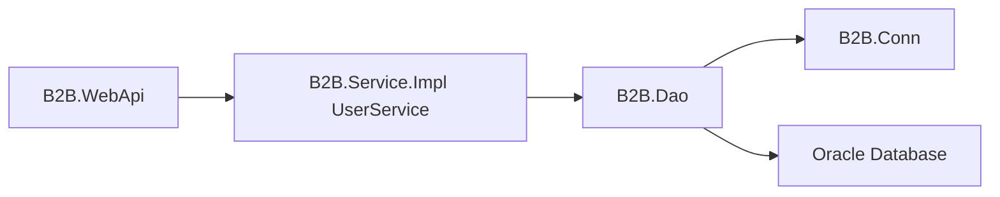

# B2B.Dao

`B2B.Dao` 是資料存取層，負責 EF Core DbContext、Oracle User Repository、Entity Mapping，以及供開發與測試使用的記憶體 Repository。它不參與 Entry 憑證登入；該流程由 `B2B.Service.Impl.AuthService` 負責。

## 專案定位



## 主要內容

| 路徑 | 說明 |
| --- | --- |
| `Contexts/` | EF Core `B2BDbContext` |
| `Entities/` | Oracle `B2B_USER` 對應的 `UserEntity` |
| `Mappings/` | Entity 與 Domain 的轉換，以及 EF Core Mapping |
| `Repositories/` | `IUserRepository`、Oracle 與 InMemory 實作 |
| `Modules/` | Autofac Module 與 DAO Options |

## 設定格式

```json
{
  "DataAccess": {
    "UseFakeRepositories": false,
    "B2BConn": {
      "EnvType": "DEV",
      "SvrType": "API",
      "DBType": "B2B",
      "AccType": "APP"
    }
  }
}
```

- `UseFakeRepositories = true`：使用 `InMemoryUserRepository`，僅限開發與測試。
- `UseFakeRepositories = false`：使用 Oracle `UserRepository`；非 Development 環境會拒絕 `true`。

`B2B.Conn` 依外部 `C:\B2B_Conn` INI 與金鑰檔取得 Oracle 連線資訊，連線字串不會寫入 `appsettings.json`。

## 維護注意事項

- 不要在 DAO 保存明文帳密或連線字串設定檔。
- User Repository 僅供 `IUserService` 查詢，不可重新耦合至 Entry 憑證登入或 JWT 簽發。
- API 回應必須經由 Web API DTO；不可將 `PasswordHash` 回傳給呼叫端。
