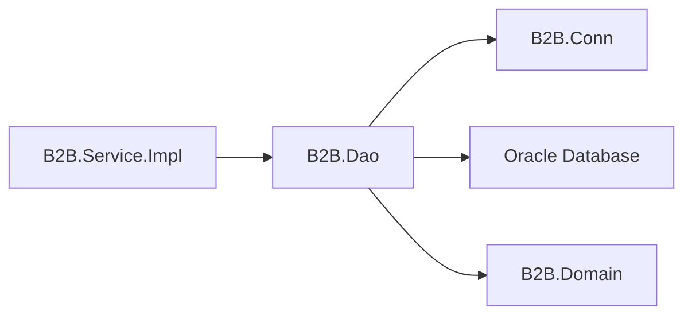
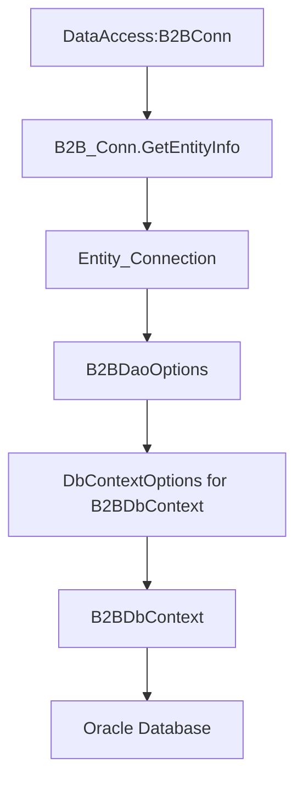
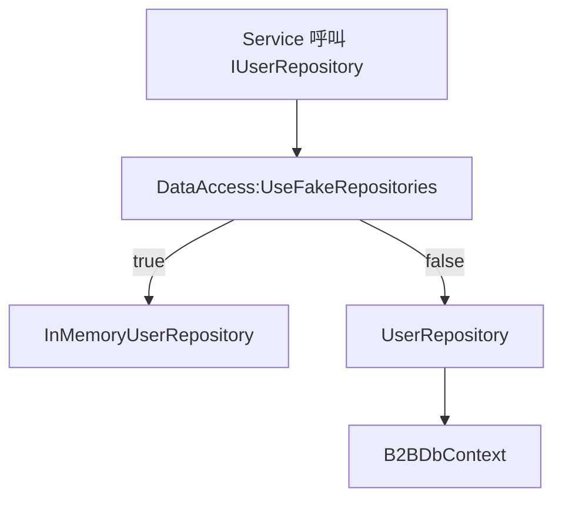

# B2B.Dao

`B2B.Dao` 是資料存取層，負責 EF Core DbContext、Oracle Repository、Entity Mapping，以及資料來源切換。此專案目前不再從 `appsettings.json` 讀取 `ConnectionStrings`，而是透過 `B2B.Conn` 取得 Oracle 連線資訊。

## 專案定位



`B2B.Dao` 對上提供 Repository 介面實作，對下負責連接 Oracle 或測試用記憶體資料來源。

## 主要內容

| 路徑 | 說明 |
| --- | --- |
| `Contexts/` | EF Core `B2BDbContext` |
| `Entities/` | Oracle 對應 Entity，例如 `UserEntity` |
| `Mappings/` | Entity 與 Domain 的轉換，以及 EF Core Entity Mapping |
| `Modules/` | Autofac Module 與 DAO Options |
| `Repositories/Interfaces/` | Repository 介面 |
| `Repositories/Implements/` | Oracle Repository 與 InMemory Repository |

## 是否使用 Module

有。此專案使用 Autofac Module。

| Module | 位置 | 用途 |
| --- | --- | --- |
| `B2BDaoModule` | `Modules/B2BDaoModule.cs` | 註冊 `B2BConnModule`、`B2BDaoOptions`、`B2BDbContext`、Repository |

## Module 使用方式

`B2BDaoModule` 由 `B2BWebApiModule` 引入：

```csharp
builder.RegisterModule<B2BDaoModule>();
```

如果其他 Host 需要資料存取能力，也可以直接註冊：

```csharp
var builder = new ContainerBuilder();
builder.RegisterModule<B2BDaoModule>();
```

使用 `B2BDaoModule` 時，Host 需提供 `IConfiguration`，並且設定 `DataAccess` 區段。

## 設定格式

```json
{
  "DataAccess": {
    "UseFakeRepositories": false,
    "B2BConn": {
      "EnvType": "DEV",
      "SvrType": "API",
      "DBType": "B2B",
      "AccType": "APP"
    }
  }
}
```

| 欄位 | 說明 |
| --- | --- |
| `UseFakeRepositories` | `true` 使用記憶體 Repository，`false` 使用 Oracle Repository |
| `EnvType` | 傳入 `B2B.Conn` 的環境別 |
| `SvrType` | 傳入 `B2B.Conn` 的服務類型 |
| `DBType` | 傳入 `B2B.Conn` 的資料庫類型 |
| `AccType` | 傳入 `B2B.Conn` 的帳號類型 |

## 連線建立流程



`B2BDaoOptions` 會保存：

- `ConnectionString`
- `EnvType`
- `SvrType`
- `DBType`
- `AccType`

Oracle EF Core 連線字串格式：

```text
User Id={Acc};Password={pwd};Data Source={DataSource};Pooling=true;Max Pool Size=100
```

## Repository 切換



正式環境應使用 `UseFakeRepositories = false`。WebApi 啟動檢查會阻擋非 Development 環境啟用 Fake Repository。

## 使用方式

服務層只依賴 Repository 介面：

```csharp
public sealed class UserService(IUserRepository userRepository)
{
    public Task<UserDomain?> GetUserAsync(string account, CancellationToken cancellationToken)
    {
        return userRepository.GetByAccountAsync(account, cancellationToken);
    }
}
```

Repository 實作由 `B2BDaoModule` 決定，呼叫端不需要知道目前使用 Oracle 或 InMemory。

## 維護注意事項

- 不要在 DAO 保存明文帳密或連線字串設定檔。
- 新增資料表時，請建立 Entity、Mapping、Repository 方法與必要 Domain 轉換。
- 若新增 Repository，請在 `B2BDaoModule` 註冊對應介面。
- DAO 不應包含商業流程，商業規則應放在 Service 層。
