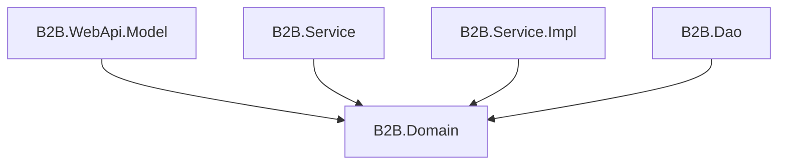
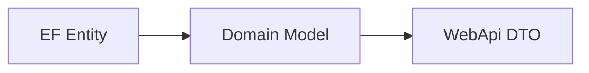

# B2B.Domain

`B2B.Domain` 是領域模型專案，保存跨 Service 與 Dao 使用的 Domain Model。此專案不依賴 WebApi DTO，也不依賴 EF Core Entity，目的是讓商業流程使用穩定的領域資料結構。

## 專案定位



## 主要內容

| 檔案或路徑 | 說明 |
| --- | --- |
| `UserDomain.cs` | 使用者領域資料 |
| `TokenDomain.cs` | Token 領域資料 |
| `LoginResultDomain.cs` | 登入與 Token 換發結果 |
| `RefreshTokenDomain.cs` | Refresh Token 狀態資料 |
| `Models/RefreshTokenModel.cs` | Refresh Token Store 使用的模型 |

## 是否使用 Module

沒有。此專案不使用 Autofac Module。

原因：

- Domain 專案只放資料結構，不需要 DI 註冊。
- Domain 物件應由 Service 或 Dao 建立與傳遞。
- 若 Domain 需要行為，也應維持與基礎建設無關，不應依賴 Autofac、EF Core 或 ASP.NET Core。

## 使用方式

DAO 將 Entity 轉為 Domain：

```csharp
UserDomain? user = await userRepository.GetByAccountAsync(account, cancellationToken);
```

Service 回傳 Domain 結果：

```csharp
LoginResultDomain result = await authService.LoginAsync(account, password, cancellationToken);
```

WebApi 再將 Domain 轉為 API Response DTO：



## 維護注意事項

- Domain 不應引用 `B2B.WebApi.Model`。
- Domain 不應引用 `B2B.Dao` Entity 或 EF Core 型別。
- Domain 欄位應代表商業概念，不應直接反映資料庫欄位命名。
- 若需要 API 專用格式，請放在 `B2B.WebApi.Model`，不要放在 Domain。
