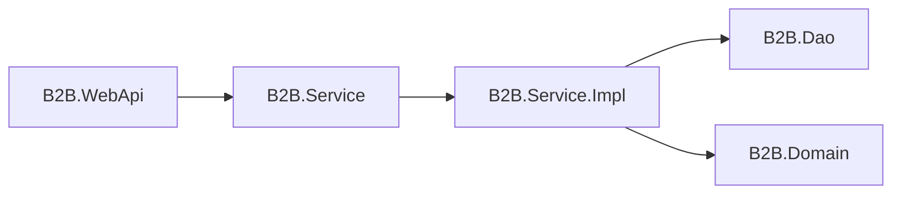
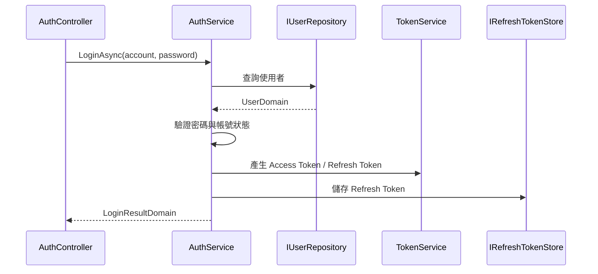
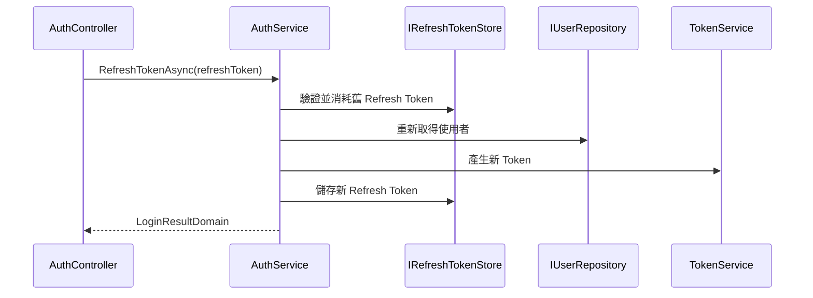

# B2B.Service.Impl

`B2B.Service.Impl` 是服務層實作專案，負責登入、使用者查詢、JWT 產生、Refresh Token 輪替與撤銷等商業流程。此專案實作 `B2B.Service` 定義的介面，並透過 `B2B.Dao` 取得資料。

## 專案定位



WebApi 只呼叫介面，實作由 Autofac Module 註冊。

## 主要內容

| 路徑 | 說明 |
| --- | --- |
| `Services/` | `AuthService`、`TokenService`、`UserService` |
| `Stores/` | `MemoryRefreshTokenStore` |
| `Mappings/` | Domain 與 Token / User 相關轉換 |
| `Modules/` | Autofac Module |

## 是否使用 Module

有。此專案使用 Autofac Module。

| Module | 位置 | 用途 |
| --- | --- | --- |
| `B2BServiceModule` | `Modules/B2BServiceModule.cs` | 註冊 Auth、User、Token 與 Refresh Token Store 服務 |

## Module 使用方式

`B2BServiceModule` 由 `B2BWebApiModule` 引入：

```csharp
builder.RegisterModule<B2BServiceModule>();
```

註冊內容：

| 介面 | 實作 | 生命週期 |
| --- | --- | --- |
| `IAuthService` | `AuthService` | `InstancePerLifetimeScope` |
| `IUserService` | `UserService` | `InstancePerLifetimeScope` |
| `ITokenService` | `TokenService` | `InstancePerLifetimeScope` |
| `IRefreshTokenStore` | `MemoryRefreshTokenStore` | `InstancePerLifetimeScope` |

## 登入流程



## Refresh Token 流程



Refresh Token 採輪替機制。舊 Token 使用後會失效，再產生新的 Access Token 與 Refresh Token。

## Options 需求

`TokenService` 需要 `JwtOptions`，由 WebApi 的 `AddB2BOptions` 綁定：

```json
{
  "Jwt": {
    "Issuer": "B2B.WebApi",
    "Audience": "B2B.Client",
    "SecretKey": "請填入至少 32 字元的安全密鑰",
    "AccessTokenMinutes": 60,
    "RefreshTokenDays": 7
  }
}
```

## 使用方式

Controller 或其他服務只依賴介面：

```csharp
public sealed class MyController(IAuthService authService)
{
    public Task<LoginResultDomain> LoginAsync(string account, string password)
    {
        return authService.LoginAsync(account, password, CancellationToken.None);
    }
}
```

## 維護注意事項

- 商業流程應放在此專案，不要放到 Controller 或 Repository。
- 新增服務實作時，需先在 `B2B.Service` 定義介面，再於 `B2BServiceModule` 註冊。
- Refresh Token 目前使用 Memory Store，服務重啟後資料會清空。
- 若未來多機部署，`IRefreshTokenStore` 應改為 Redis、Distributed Cache 或資料庫實作。
