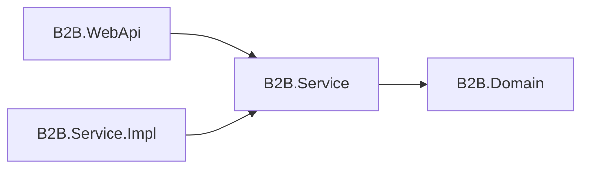

# B2B.Service

`B2B.Service` 是服務層抽象專案，負責定義 WebApi 與服務實作之間的介面、Options 與跨層服務契約。此專案不包含商業流程實作，主要用來讓 `B2B.WebApi` 依賴抽象而不是依賴具體類別。

## 專案定位



## 主要內容

| 路徑 | 說明 |
| --- | --- |
| `IAuthService.cs` | 登入、Refresh Token、登出流程介面 |
| `IUserService.cs` | Web API 使用者查詢服務介面 |
| `ITokenService.cs` | Token 產生介面 |
| `Interfaces/` | 其他服務抽象，例如 `IEntryCredentialValidator`、`IRefreshTokenStore` |
| `Options/` | 服務層 Options，例如 `JwtOptions` |

## 是否使用 Module

沒有。此專案不使用 Autofac Module。

原因：

- 此專案只放介面與 Options，不包含具體實作。
- Autofac 註冊應由實作專案 `B2B.Service.Impl` 的 `B2BServiceModule` 負責。
- Options 綁定由 Host 專案 `B2B.WebApi` 的 `AddB2BOptions` 負責。

## 使用方式

Controller 依賴服務介面：

```csharp
public sealed class AuthController(IAuthService authService) : ControllerBase
{
}
```

服務實作專案實作介面：

```csharp
public sealed class AuthService : IAuthService
{
}
```

DI 註冊由 `B2B.Service.Impl` 提供：

```csharp
builder.RegisterType<AuthService>()
    .As<IAuthService>()
    .InstancePerLifetimeScope();
```

## JwtOptions

`JwtOptions` 對應 `Jwt` 設定區段：

```json
{
  "Jwt": {
    "Issuer": "B2B.WebApi",
    "Audience": "B2B.Client",
    "SecretKey": "請填入至少 32 字元的安全密鑰",
    "AccessTokenMinutes": 60,
    "RefreshTokenDays": 7
  }
}
```

| 欄位 | 說明 |
| --- | --- |
| `Issuer` | JWT 簽發者 |
| `Audience` | JWT 使用對象 |
| `SecretKey` | JWT 簽章密鑰，至少 32 字元 |
| `AccessTokenMinutes` | Access Token 有效分鐘數 |
| `RefreshTokenDays` | Refresh Token 有效天數 |

## 維護注意事項

- 此專案只放抽象與 Options，不放實作。
- 新增服務能力時，先在此專案定義介面，再到 `B2B.Service.Impl` 實作。
- 介面應使用 Domain Model，不應直接暴露 WebApi DTO 或 EF Entity。
- Options 類別應包含驗證屬性，並由 Host 使用 `ValidateOnStart` 檢查。
