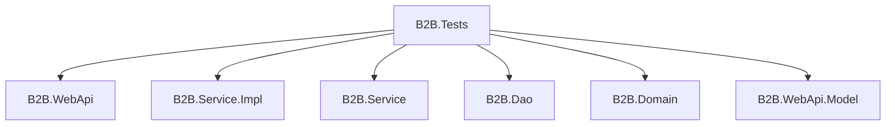
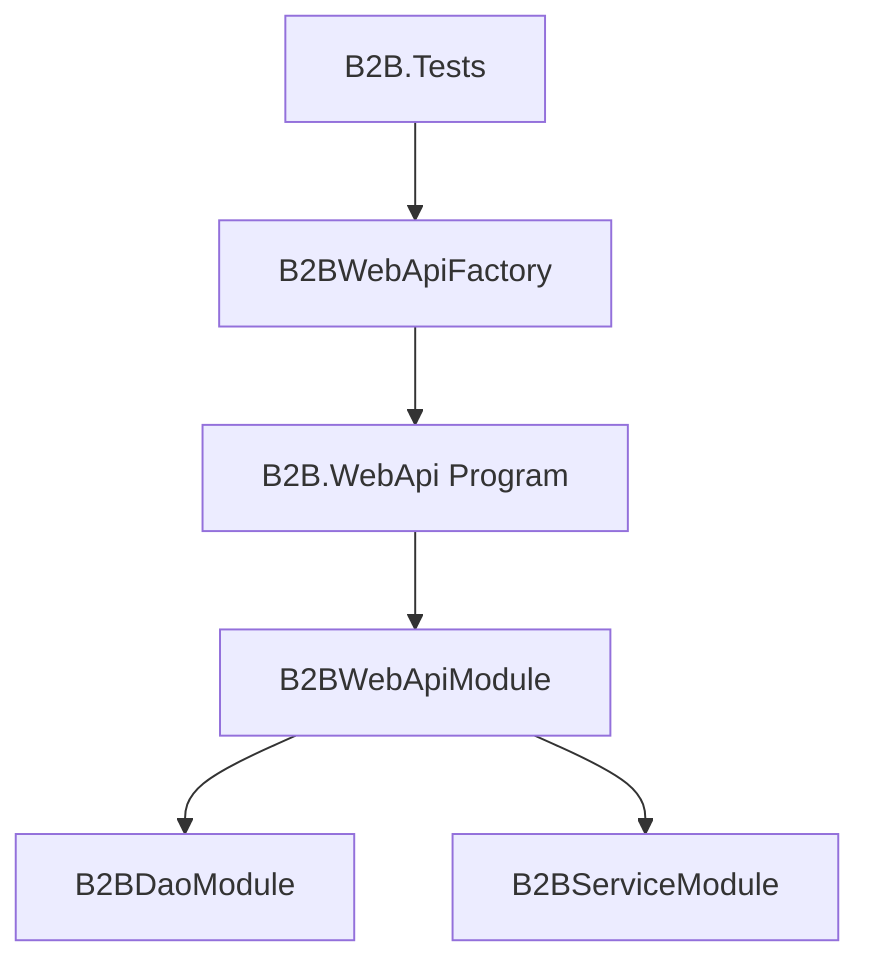
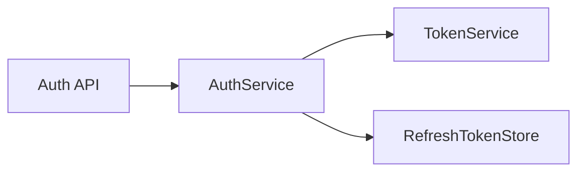

# B2B.Tests

`B2B.Tests` 是測試專案，負責驗證 WebApi、AuthService、TokenService 與相關流程。此專案使用 xUnit 與 `Microsoft.AspNetCore.Mvc.Testing` 建立測試 Host，並透過測試替身或設定覆寫降低外部環境依賴。

## 專案定位



## 主要內容

| 檔案 | 說明 |
| --- | --- |
| `AuthApiTests.cs` | Auth API 整合測試 |
| `AuthServiceTests.cs` | Auth Service 行為測試 |
| `TokenServiceTests.cs` | Token 產生與驗證相關測試 |
| `B2BWebApiFactory.cs` | WebApi 測試 Host Factory 與設定覆寫 |
| `TestDoubles.cs` | 測試替身與輔助類別 |

## 是否使用 Module

沒有。此測試專案本身不定義 Autofac Module。

但測試 Host 會啟動 `B2B.WebApi`，因此會間接使用正式程式中的 Module：



若測試需要替換服務，應透過測試 Host 的設定或服務覆寫處理，不建議在測試專案新增自己的生產 Module。

## 測試設定

`B2BWebApiFactory` 會覆寫部分設定，例如：

```json
{
  "DataAccess": {
    "UseFakeRepositories": true,
    "B2BConn": {
      "EnvType": "DEV",
      "SvrType": "API",
      "DBType": "B2B",
      "AccType": "APP"
    }
  }
}
```

這讓測試可以避免直接依賴正式 Oracle 連線。

## 執行方式

執行所有測試：

```powershell
dotnet test
```

只執行測試專案：

```powershell
dotnet test B2B.Tests
```

## 測試範圍



目前測試重點：

- 登入成功與失敗情境。
- Token 產生、驗證與到期時間。
- Refresh Token 換發與撤銷。
- API 回應格式是否符合預期。

## 維護注意事項

- 新增 API 時，建議補上 Controller 整合測試。
- 新增 Service 行為時，建議補上單元測試。
- 測試不要依賴正式 `C:\B2B_Conn` 機密檔案。
- 測試設定應集中在 `B2BWebApiFactory`，避免各測試自行散落設定。
