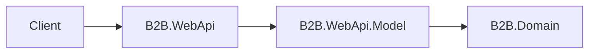
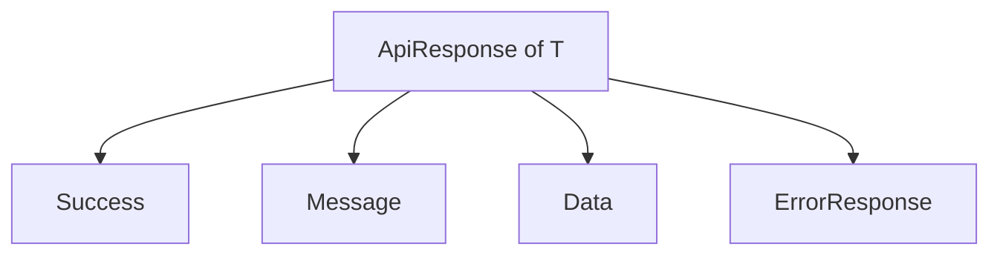

# B2B.WebApi.Model

`B2B.WebApi.Model` 是 API 對外模型專案，負責定義 Request、Response 與共用 API 回應格式。此專案是 HTTP 邊界使用的 DTO，不應包含商業流程或資料庫存取邏輯。

## 專案定位



## 主要內容

| 路徑 | 說明 |
| --- | --- |
| `Auth/` | 登入、Refresh Token、登出相關 Request / Response |
| `Common/` | `ApiResponse<T>` 與 `ErrorResponse` |

## 是否使用 Module

沒有。此專案不使用 Autofac Module。

原因：

- DTO 與 Response Model 不需要 DI 註冊。
- 此專案沒有服務實作、Repository 或需要生命週期管理的物件。
- API 模型由 Controller 直接使用，或由 Mapping 擴充方法建立。

## API 回應格式



成功回應：

```json
{
  "success": true,
  "message": "成功",
  "data": {}
}
```

失敗回應：

```json
{
  "success": false,
  "message": "登入失敗",
  "error": {
    "code": "AUTH_FAILED",
    "message": "登入失敗"
  }
}
```

## Auth DTO

| 模型 | 用途 |
| --- | --- |
| `LoginRequest` | 登入請求，包含 AES 加密的 `encryptedCredential` |
| `LoginResponse` | 登入成功回應，包含 Token 與使用者資訊 |
| `RefreshTokenRequest` | Refresh Token 換發請求 |
| `RefreshTokenResponse` | Refresh Token 換發成功回應 |
| `LogoutRequest` | 登出請求，包含要撤銷的 Refresh Token |
| `UserResponse` | 使用者查詢回應；不含 PasswordHash |

## 使用方式

Controller 使用 Request 與 Response：

```csharp
[HttpPost("login")]
public async Task<ActionResult<ApiResponse<LoginResponse>>> Login(
    [FromBody] LoginRequest request,
    CancellationToken cancellationToken)
{
}
```

失敗時使用 `ErrorResponse`：

```csharp
return Unauthorized(ApiResponse<LoginResponse>.Fail(
    "憑證驗證失敗",
    new ErrorResponse("INVALID_ENTRY_CREDENTIAL", "憑證驗證失敗")));
```

## 維護注意事項

- 此專案只放 API 邊界模型，不放商業邏輯。
- DTO 可以依前端或外部 API 契約調整，但不要直接暴露 EF Entity。
- 新增 API 時應建立明確的 Request / Response 類別，不建議直接使用 Domain 作為對外格式。
- 共用錯誤格式應維持 `ApiResponse<T>` 與 `ErrorResponse` 一致。
