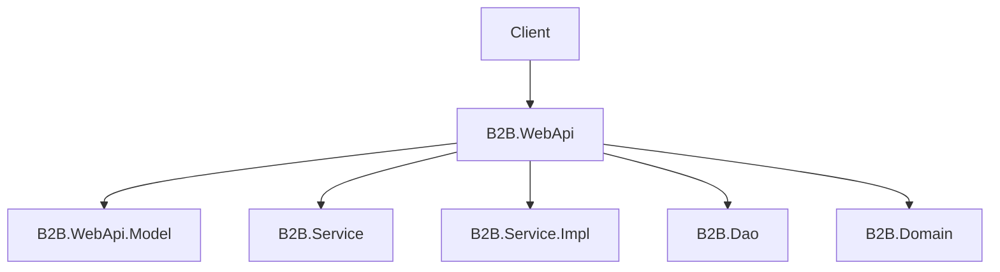
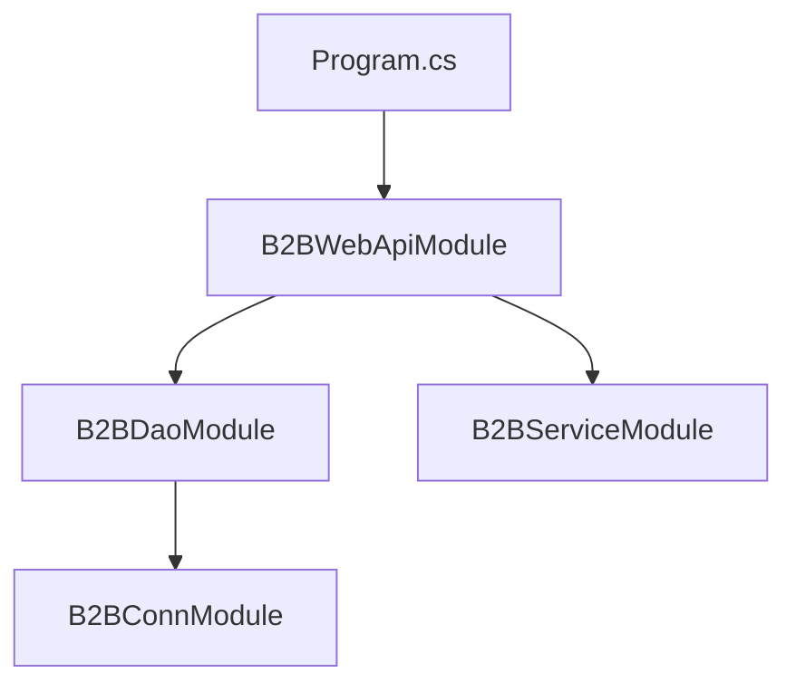
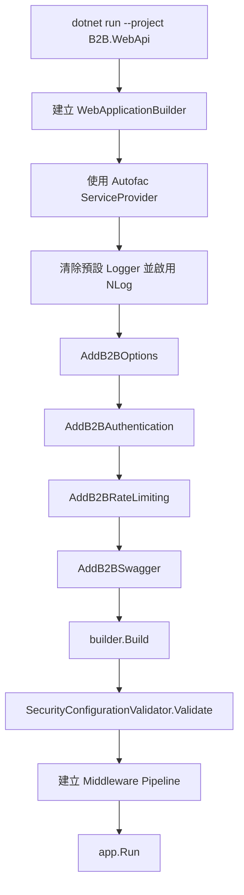
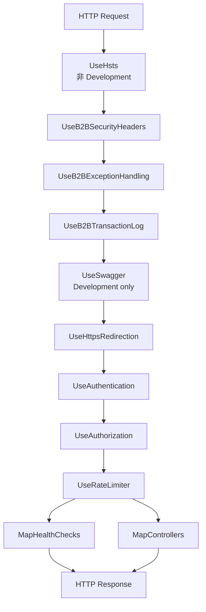

# B2B.WebApi

`B2B.WebApi` 是整個系統的 HTTP API 入口，也是 Composition Root。此專案負責建立 ASP.NET Core Host、載入設定、註冊服務、組裝 Autofac Module、建立 Middleware Pipeline，並提供 Controller、Swagger、Health Check、JWT 驗證、Rate Limit、Transaction Log 與全域例外處理。

## 專案定位



`B2B.WebApi` 不直接實作資料存取邏輯，也不直接處理 Oracle 連線解析。它只負責把 Web API 所需的各層服務組裝起來。

## 主要內容

| 路徑 | 說明 |
| --- | --- |
| `Program.cs` | API 啟動點，設定 Autofac、NLog、Options、Authentication、Rate Limit、Swagger 與 Middleware Pipeline |
| `Controllers/` | HTTP API Controller，目前包含 Auth 與 Health 相關入口 |
| `Extensions/` | WebApi 專用服務註冊、Middleware 註冊、JWT、NLog、安全設定檢查 |
| `HealthChecks/` | Readiness 檢查，目前透過 `B2BDbContext` 檢查 Oracle 是否可連線 |
| `Mappings/` | WebApi DTO 與 Service 結果的轉換 |
| `Middlewares/` | Transaction Log 與 Exception Handling |
| `Modules/` | WebApi 根 Autofac Module |
| `Options/` | WebApi 專用 Options，例如 `TransactionLogOptions` |
| `appsettings.json` | WebApi 設定來源 |
| `nlog.config` | NLog 輸出設定 |

## 是否使用 Module

有。此專案使用 Autofac Module。

| Module | 位置 | 用途 |
| --- | --- | --- |
| `B2BWebApiModule` | `Modules/B2BWebApiModule.cs` | WebApi 根模組，負責引入 `B2BDaoModule` 與 `B2BServiceModule` |

## Module 使用方式

`Program.cs` 會把 ASP.NET Core 預設 DI 容器切換為 Autofac，並註冊 WebApi 根模組：

```csharp
builder.Host.UseServiceProviderFactory(new AutofacServiceProviderFactory());
builder.Host.ConfigureContainer<ContainerBuilder>(containerBuilder =>
    containerBuilder.RegisterModule<B2BWebApiModule>());
```

模組組裝流程：



新增 WebApi 需要的跨層依賴時，優先放到對應專案的 Module；只有 WebApi 自己的啟動、Middleware、Options 或 ASP.NET Core 服務註冊才放在 `Program.cs` 或 `Extensions/`。

## 啟動流程



## HTTP Pipeline



## 設定格式

`B2B.WebApi` 主要使用下列設定區段：

```json
{
  "Jwt": {
    "Issuer": "B2B.WebApi",
    "Audience": "B2B.Client",
    "SecretKey": "請填入至少 32 字元的安全密鑰",
    "AccessTokenMinutes": 60,
    "RefreshTokenDays": 7
  },
  "DataAccess": {
    "UseFakeRepositories": false,
    "B2BConn": {
      "EnvType": "DEV",
      "SvrType": "API",
      "DBType": "B2B",
      "AccType": "APP"
    }
  },
  "TransactionLog": {
    "Enabled": true,
    "IncludeRequestBody": false,
    "IncludeResponseBody": false,
    "TrustForwardedHeaders": false,
    "MaxBodyLogLength": 10000
  },
  "RefreshTokenStore": {
    "Provider": "Memory"
  },
  "AllowedHosts": "localhost"
}
```

注意：Oracle 連線字串不再放在 `ConnectionStrings`，而是由 `DataAccess:B2BConn` 交給 `B2B.Conn` 解析。

## 對外 API

| Method | Route | 說明 |
| --- | --- | --- |
| `POST` | `/api/auth/login` | 登入並取得 Access Token 與 Refresh Token |
| `POST` | `/api/auth/refresh-token` | 使用 Refresh Token 換發新的 Token |
| `POST` | `/api/auth/logout` | 登出並撤銷 Refresh Token |
| `GET` | `/health/live` | Liveness 檢查 |
| `GET` | `/health/ready` | Readiness 檢查，包含 Oracle 連線 |

## 執行方式

```powershell
dotnet run --project B2B.WebApi
```

Development 環境會啟用 Swagger：

```text
https://localhost:<port>/swagger
```

若 HTTPS 沒有啟動，請確認 `Properties/launchSettings.json` 的 `applicationUrl` 包含 `https://...`，並信任本機開發憑證：

```powershell
dotnet dev-certs https --trust
```

## 維護注意事項

- 新增 Controller 時，請回傳 `ApiResponse<T>`，保持 API 格式一致。
- 需要讀取新設定時，優先建立 Options 類別並在 `AddB2BOptions` 註冊。
- 非 Development 環境會執行安全設定檢查，不應使用預設 JWT Secret、`AllowedHosts = *` 或開啟敏感 Body Log。
- WebApi 只負責組裝與 HTTP 入口，不應放入資料庫查詢或商業流程。
