# B2B API

B2B API 是以 ASP.NET Core Web API 為入口、Autofac Module 為模組組裝方式的分層專案。  
目前 Oracle 連線字串不再由 `appsettings.json` 提供，而是由 `B2B.Conn` 依照環境、主機、資料庫與帳號類型解析後，再交由 `B2B.Dao` 建立資料存取設定。

## 專案結構總覽

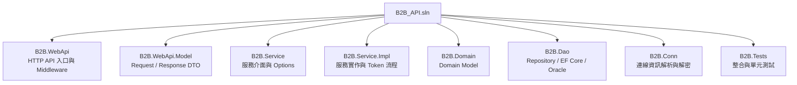

```text
B2B_API
├─ B2B.WebApi              API Host、Controller、Middleware、Swagger、驗證與安全設定
├─ B2B.WebApi.Model        API 請求與回應模型
├─ B2B.Service             Service 介面、Options 與跨層抽象
├─ B2B.Service.Impl        Auth / User Query / Token Service 實作
├─ B2B.Domain              Domain Model 與領域資料結構
├─ B2B.Dao                 DbContext、User Repository、DAO Module
├─ B2B.Conn                AWS 離線環境連線資訊解析、INI 讀取、解密
├─ B2B.Tests               測試專案
└─ resources/B2B_Conn      B2B.Conn 還原參考截圖
```

## 專案職責

| 專案 | 職責 | 主要輸出 |
| --- | --- | --- |
| `B2B.WebApi` | API 啟動、Controller、Middleware、Swagger、認證授權、Rate Limit、Health Check | HTTP API |
| `B2B.WebApi.Model` | API DTO 與共用回應格式 | `ApiResponse<T>`、Login/Refresh Request |
| `B2B.Service` | Service 介面與 Options | `IAuthService`、`ITokenService`、`JwtOptions` |
| `B2B.Service.Impl` | 商業流程實作 | Entry Login、User Query、Refresh Token、JWT 產生 |
| `B2B.Domain` | Domain Model | Service Identity、User、Token、Login Result |
| `B2B.Dao` | 資料存取 | `B2BDbContext`、`IUserRepository`、Oracle Repository |
| `B2B.Conn` | 連線帳密解析 | `B2B_Conn.GetEntityInfo(...)` |
| `B2B.Tests` | 測試與 WebApi Factory | 測試用 Host 與設定覆寫 |

## 專案相依關係

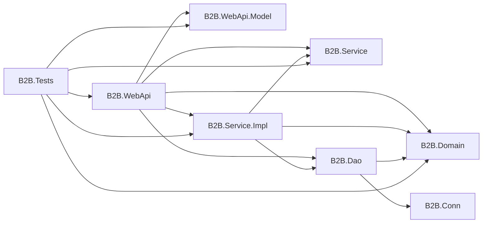

相依方向原則：

- `B2B.WebApi` 是 Composition Root，負責組裝所有 Module。
- `B2B.Service` 只定義介面與 Options，不依賴實作層。
- `B2B.Service.Impl` 的 AuthService 只負責服務憑證與 Token；UserService 則依賴 `B2B.Dao` 提供查詢。
- `B2B.Dao` 依賴 `B2B.Conn` 取得 Oracle 連線資訊，供 User 查詢與 readiness health check 使用。
- `B2B.Conn` 不需要被 Entry 憑證認證流程直接呼叫。

## NuGet 相依關係

```mermaid
flowchart TB
    WebApi["B2B.WebApi"]
    ServiceImpl["B2B.Service.Impl"]
    Dao["B2B.Dao"]
    Conn["B2B.Conn"]
    Tests["B2B.Tests"]

    Autofac["Autofac / Autofac.Extensions.DependencyInjection"]
    JwtBearer["Microsoft.AspNetCore.Authentication.JwtBearer"]
    Swagger["Microsoft.AspNetCore.OpenApi / Swashbuckle.AspNetCore"]
    NLog["NLog.Web.AspNetCore"]
    EF["Microsoft.EntityFrameworkCore"]
    OracleEF["Oracle.EntityFrameworkCore"]
    MemoryCache["Microsoft.Extensions.Caching.Memory"]
    JwtToken["System.IdentityModel.Tokens.Jwt"]
    Testing["xUnit / Microsoft.AspNetCore.Mvc.Testing / coverlet"]

    WebApi --> Autofac
    WebApi --> JwtBearer
    WebApi --> Swagger
    WebApi --> NLog
    WebApi --> OracleEF
    WebApi --> EF

    ServiceImpl --> Autofac
    ServiceImpl --> MemoryCache
    ServiceImpl --> JwtToken

    Dao --> Autofac
    Dao --> EF
    Dao --> OracleEF

    Conn --> Autofac
    Tests --> Testing
```

主要套件用途：

- Autofac：以 Module 管理跨專案 DI 註冊。
- EF Core / Oracle.EntityFrameworkCore：建立 Oracle DbContext 與 Repository。
- JwtBearer / System.IdentityModel.Tokens.Jwt：處理 JWT 驗證與 Token 產生。
- NLog.Web.AspNetCore：應用程式與交易紀錄輸出。
- Swashbuckle.AspNetCore：Development 環境 Swagger 文件。
- xUnit / Mvc.Testing：測試 WebApi Host 與 API 行為。

## Autofac Module 組裝流程

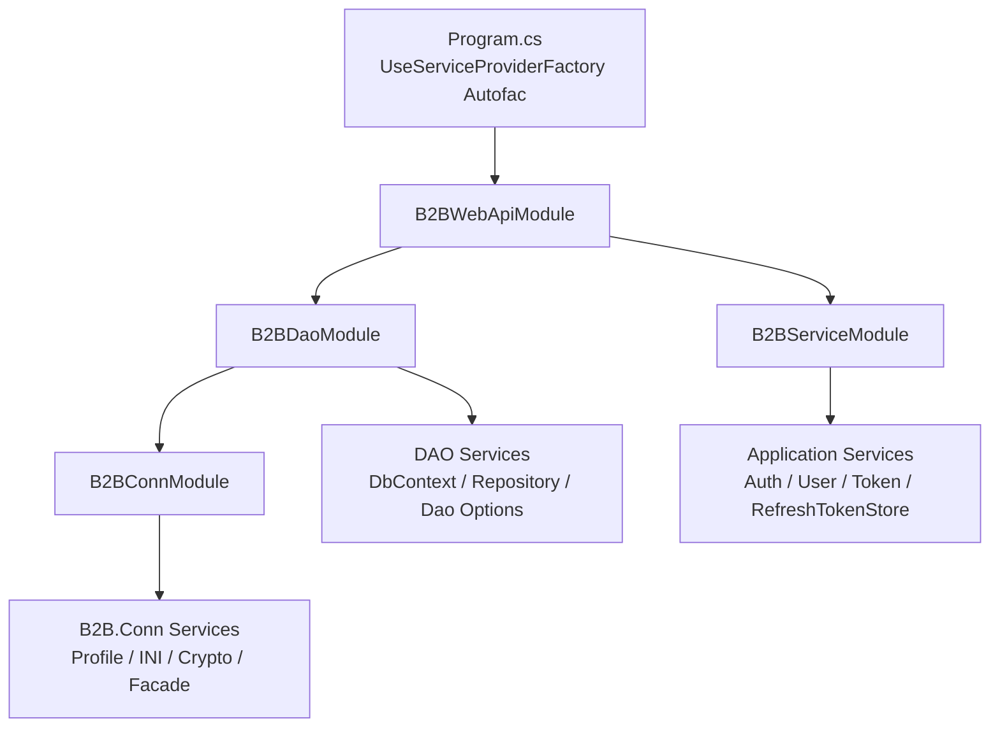

`B2B.WebApi` 啟動時只註冊 `B2BWebApiModule`，再由此 Module 統一引入：

- `B2BDaoModule`：資料存取與 Oracle 連線設定。
- `B2BServiceModule`：應用服務、Token 與 Refresh Token Store。
- `B2BConnModule`：由 `B2BDaoModule` 引入，用於解析 Oracle 帳密與連線端點。

### Module 使用方式

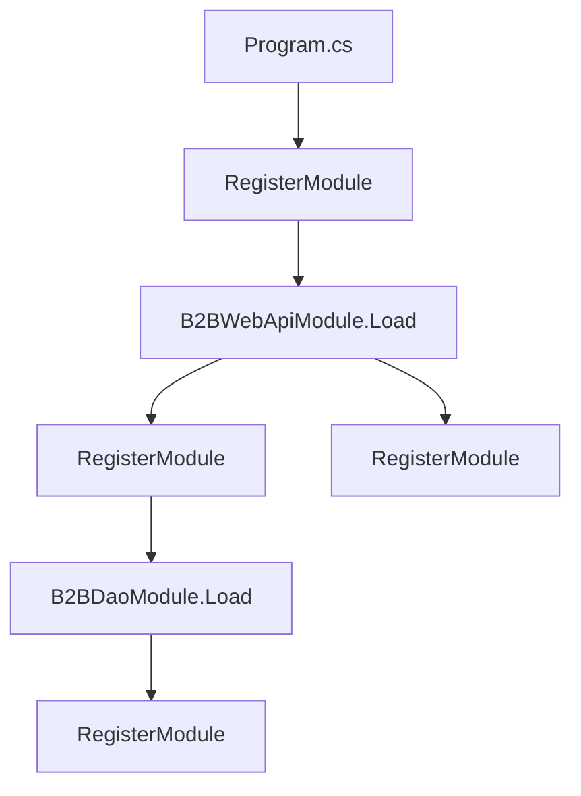

`Program.cs` 只需要註冊 WebApi 根模組：

```csharp
builder.Host.UseServiceProviderFactory(new AutofacServiceProviderFactory());
builder.Host.ConfigureContainer<ContainerBuilder>(containerBuilder =>
    containerBuilder.RegisterModule<B2BWebApiModule>());
```

其他專案不需要在 `Program.cs` 個別註冊實作類別，由各自 Module 負責維護。

## 啟動流程

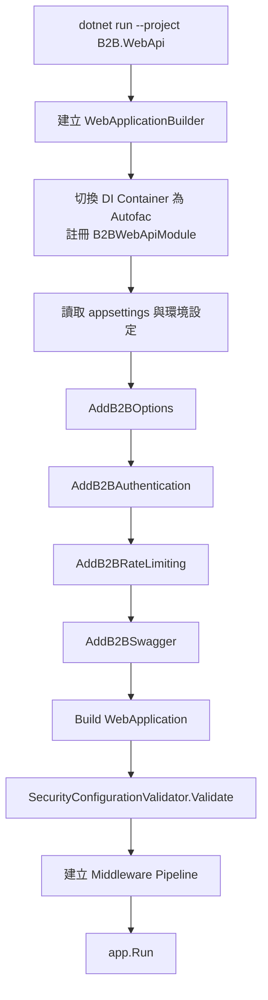

啟動時會在 `builder.Build()` 後執行安全設定檢查。非 Development 環境中特別會阻擋下列設定：

- `DataAccess:UseFakeRepositories = true`
- `TransactionLog:IncludeRequestBody = true`
- `TransactionLog:IncludeResponseBody = true`
- `AllowedHosts` 為空白或 `*`
- JWT SecretKey 為空白、預設值或不安全佔位值

## HTTP Pipeline

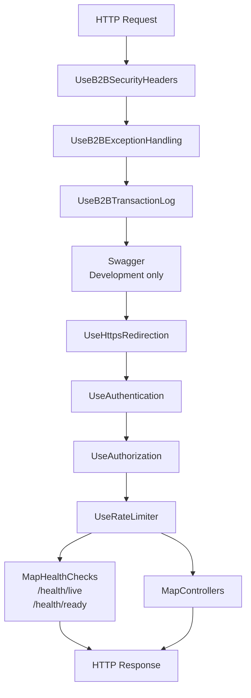

Middleware 重點：

- Security Headers：加入基本安全回應標頭。
- Exception Handling：集中處理未捕捉例外，回傳一致的 API 錯誤格式。
- Transaction Log：記錄請求、回應、TraceId、耗時、Client IP、User-Agent。
- HTTPS Redirection：將 HTTP 導向 HTTPS。
- Authentication / Authorization：使用 JWT Bearer Token。
- Rate Limiter：限制登入等敏感 API 的請求頻率。
- Health Checks：提供 liveness 與 readiness 檢查。

## 設定結構

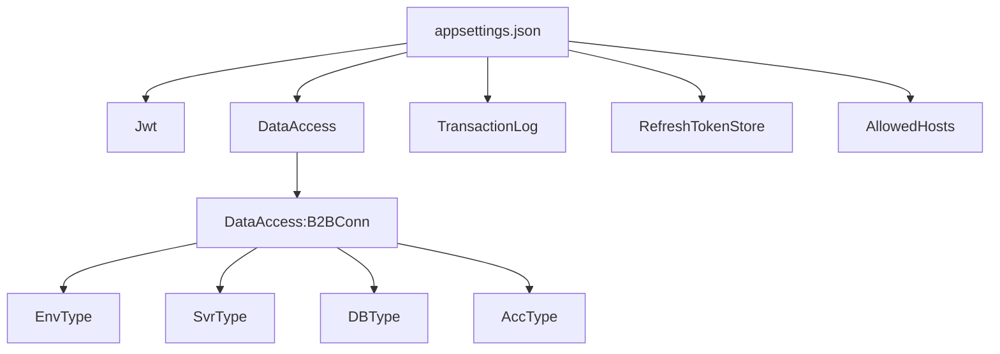

目前 `appsettings.json` 不再需要 `ConnectionStrings`。  
Oracle 連線一律透過下列設定交由 `B2B.Conn` 解析：

```json
{
  "DataAccess": {
    "UseFakeRepositories": false,
    "B2BConn": {
      "EnvType": "DEV",
      "SvrType": "API",
      "DBType": "B2B",
      "AccType": "APP"
    }
  }
}
```

### Jwt

```json
{
  "Jwt": {
    "Issuer": "B2B.WebApi",
    "Audience": "B2B.Client",
    "SecretKey": "請填入至少 32 字元的安全密鑰",
    "AccessTokenMinutes": 60,
    "RefreshTokenDays": 7
  }
}
```

| 欄位 | 說明 |
| --- | --- |
| `Issuer` | JWT 簽發者 |
| `Audience` | JWT 使用對象 |
| `SecretKey` | HMAC 簽章密鑰，至少 32 字元 |
| `AccessTokenMinutes` | Access Token 有效分鐘數 |
| `RefreshTokenDays` | Refresh Token 有效天數 |

### TransactionLog

```json
{
  "TransactionLog": {
    "Enabled": true,
    "IncludeRequestBody": false,
    "IncludeResponseBody": false,
    "TrustForwardedHeaders": false,
    "MaxBodyLogLength": 10000
  }
}
```

| 欄位 | 說明 |
| --- | --- |
| `Enabled` | 是否啟用交易紀錄 |
| `IncludeRequestBody` | 是否記錄 Request Body，正式環境不建議啟用 |
| `IncludeResponseBody` | 是否記錄 Response Body，正式環境不建議啟用 |
| `TrustForwardedHeaders` | 是否信任反向代理傳入的 Forwarded Headers |
| `MaxBodyLogLength` | Body 最大記錄長度 |

### RefreshTokenStore

```json
{
  "RefreshTokenStore": {
    "Provider": "Memory"
  }
}
```

目前 Refresh Token Store 實作為記憶體版本，程式啟動後 Token 狀態保存在目前行程內。重啟服務後，既有 Refresh Token 狀態會消失。

## B2B.Conn 連線解析流程

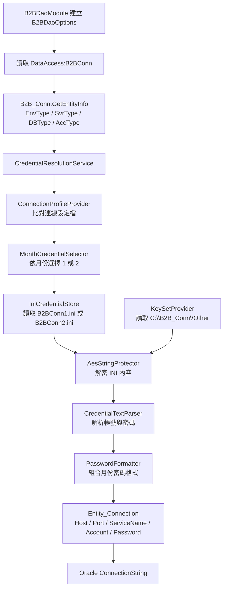

`B2B.Conn` 保留外部呼叫介面，主要入口為：

```csharp
var entity = B2B_Conn.B2B_Conn.GetEntityInfo(envType, svrType, dbType, accType);
```

回傳結果會包含資料庫連線所需資訊，`B2B.Dao` 再將它轉為 EF Core Oracle 使用的格式：

```text
User Id={Account};
Password={Password};
Data Source={Host}:{Port}/{ServiceName};
Pooling=true;
Max Pool Size=100
```

### B2B.Conn 外部檔案需求

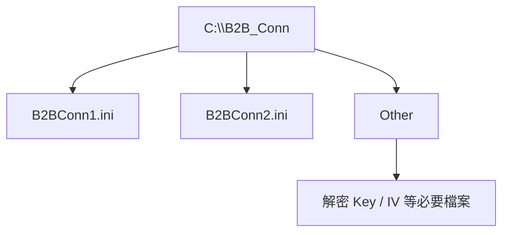

`B2B.Conn` 還原自 AWS 離線環境截圖，因此實際帳密、INI 與金鑰檔不會提交到 Git。部署或本機執行時，必須由環境提供 `C:\B2B_Conn` 相關檔案。

## DAO 運作流程

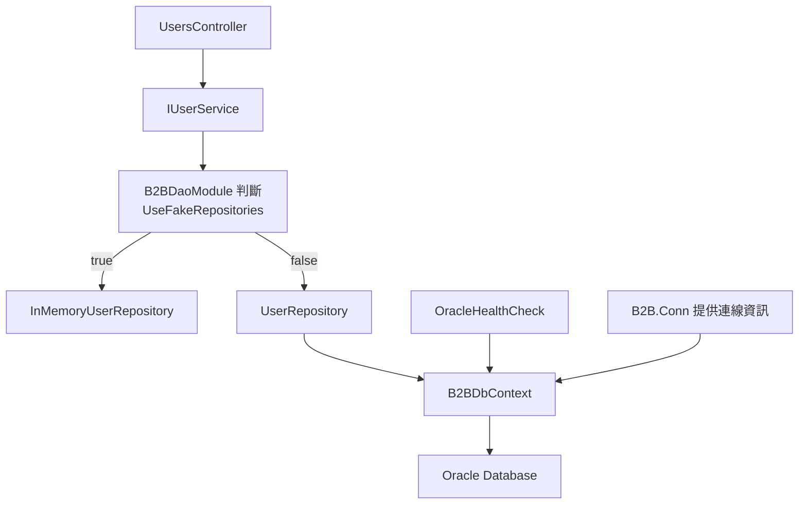

Entry 憑證登入與 User 查詢是兩條獨立流程：JWT 簽發不讀取 User Repository；已驗證的服務可透過 `IUserService` 查詢使用者。`DataAccess:UseFakeRepositories` 可讓開發與測試使用記憶體 Repository，正式環境必須為 `false`。

## 登入流程

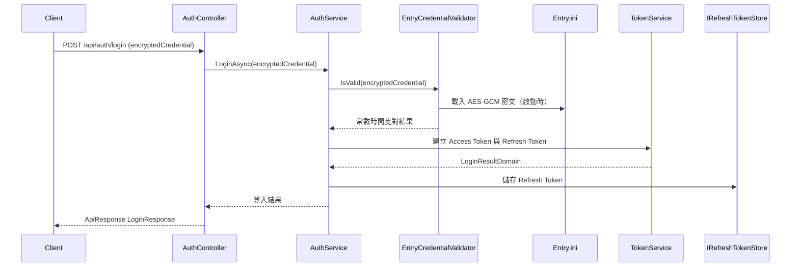

登入請求只接受 `encryptedCredential`，即其他專案讀取其 `Entry.ini` 後原樣傳入的 AES-GCM 密文。比對成功後，JWT 會代表固定的 `entry-credential` 服務身分，而非資料庫使用者。

## User 查詢流程

`UsersController` 要求有效的 Service JWT，並透過 `IUserService` 查詢使用者。回應只包含 `UserId`、`Account`、`DisplayName`、`IsActive` 與 `CreatedAt`，絕不回傳 `PasswordHash`。

| Method | Route | 說明 |
| --- | --- | --- |
| `GET` | `/api/users/{userId}` | 依使用者識別碼查詢 |
| `GET` | `/api/users/by-account/{account}` | 依登入帳號查詢 |

登入成功後會回傳：

- Access Token：用於後續 API 的 Bearer Token。
- Refresh Token：用於 Access Token 過期後換發新 Token。
- 使用者基本資訊與 Token 到期時間。

## Refresh Token 流程

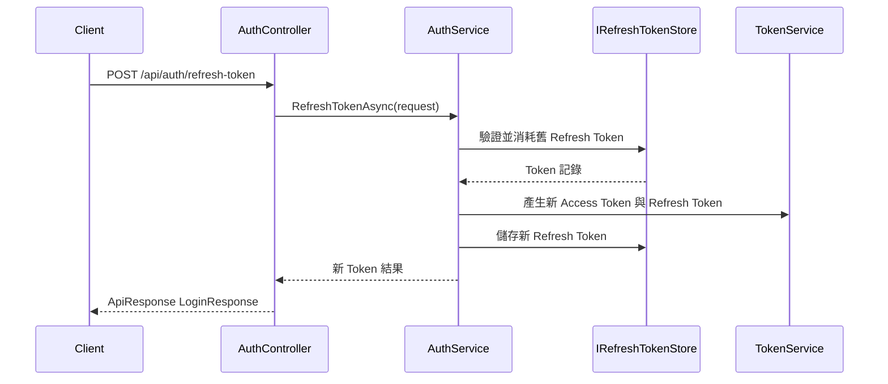

Refresh Token 採用輪替機制。舊 Token 使用後會失效，並由服務產生新的 Token 組合。

### Entry.ini 憑證

根目錄的 `Entry.ini` 必須只有一行 `AES-GCM-V1:<Base64 payload>`。建置與發佈時會將檔案複製至 Web API 的應用程式根目錄；其他專案必須部署相同檔案，並將整行內容放入登入請求：

```json
{
  "encryptedCredential": "<Entry.ini 的完整內容>"
}
```

版控中的值是公開 AES-GCM 開發範例。Production 或 Staging 等非 Development 環境會拒絕這個範例，部署前必須以專屬的 AES-GCM 密文取代。密文本身是可重放的共享憑證，僅能經由 HTTPS 傳送，且不應寫入日誌、原始碼或版本控制。

## 登出流程

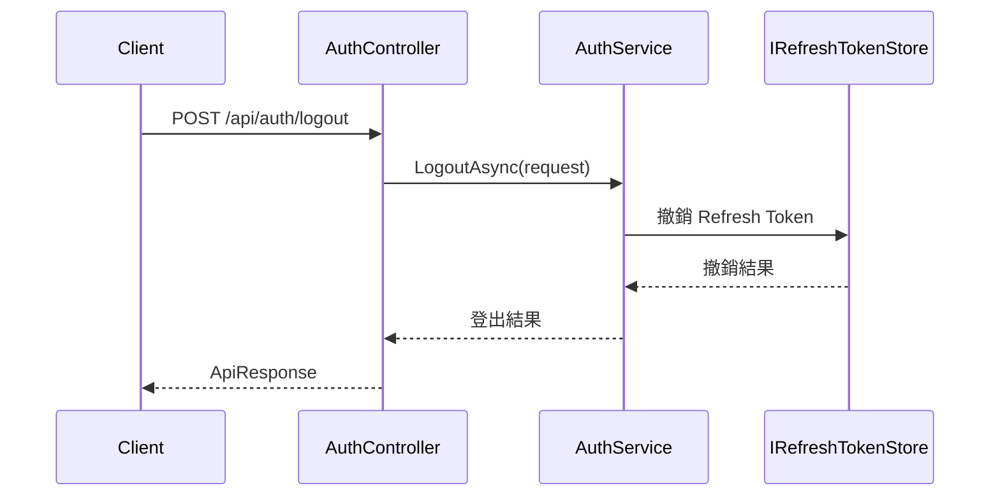

登出會使指定 Refresh Token 失效。Access Token 因為是 JWT，仍會在原本效期內自然過期；需要立即封鎖時，需再加入 Token 黑名單或版本號檢查機制。

## 例外與交易紀錄流程

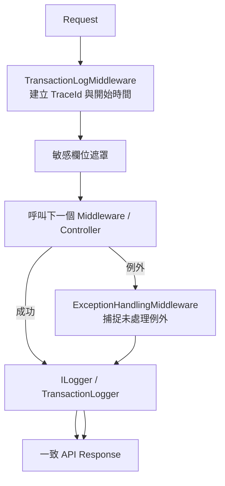

交易紀錄會記錄：

- TraceId
- HTTP Method、Path、QueryString
- Status Code
- Client IP、User-Agent
- Request / Response 時間
- Elapsed Milliseconds
- 選擇性 Request Body / Response Body

敏感資料會在寫入紀錄前遮罩，避免密碼、Token 等資訊直接出現在 Log 中。

## Health Check 流程

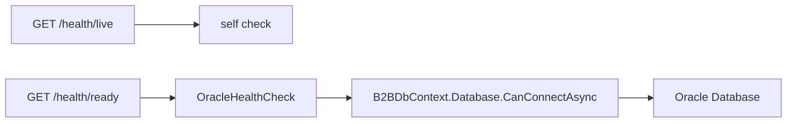

| Endpoint | 用途 | 檢查內容 |
| --- | --- | --- |
| `/health/live` | Liveness | API 行程是否存活 |
| `/health/ready` | Readiness | API 是否可連線至 Oracle |

## API 回應格式

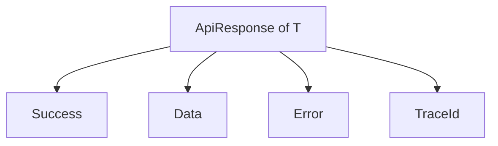

API 回應會透過共用格式包裝，成功與失敗皆會保留一致結構，方便前端或呼叫端統一處理。

## Rate Limit 流程

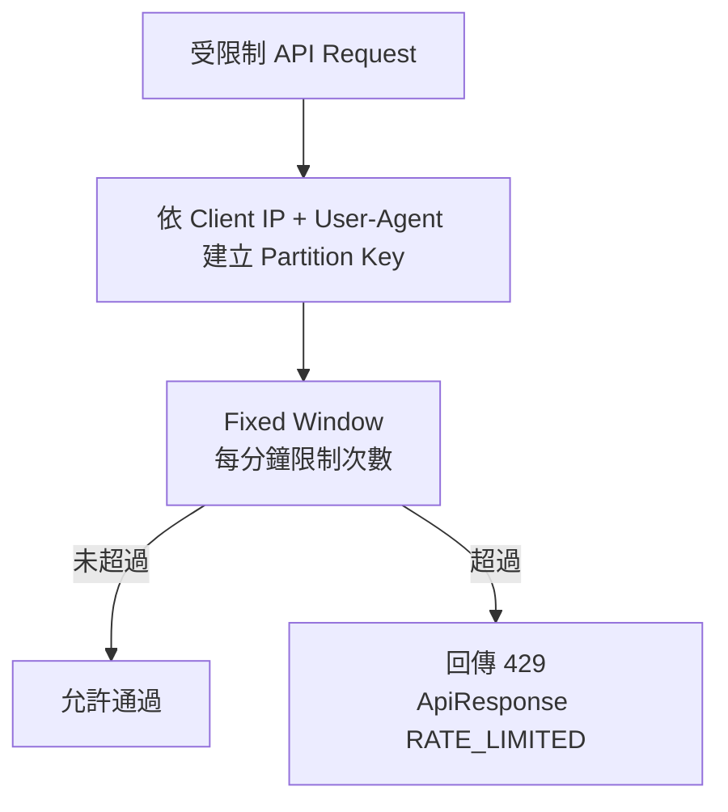

目前登入等敏感 API 可套用 Rate Limit，避免短時間大量嘗試。

## 本機執行

### 還原套件

```powershell
dotnet restore
```

### 建置

```powershell
dotnet build
```

### 啟動 Web API

```powershell
dotnet run --project B2B.WebApi
```

若要讓 `dotnet run` 同時啟動 HTTPS，請確認 `B2B.WebApi/Properties/launchSettings.json` 的 `applicationUrl` 包含 `https://...`，並且本機已信任 ASP.NET Core 開發憑證：

```powershell
dotnet dev-certs https --trust
```

## 測試

```powershell
dotnet test
```

測試專案會使用 `B2BWebApiFactory` 覆寫部分設定，避免測試環境依賴正式環境的 Oracle 連線資訊。

## 部署注意事項

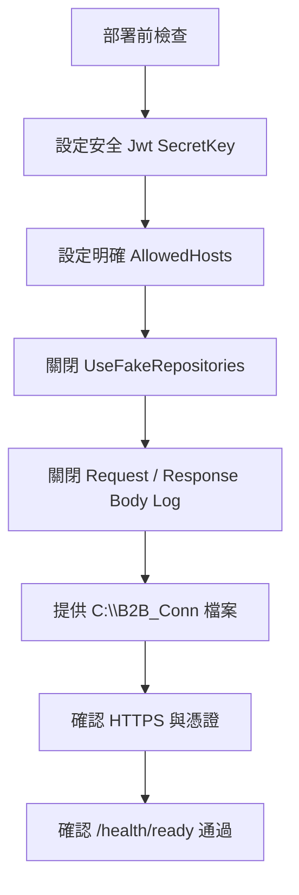

正式環境至少應確認：

- `Jwt:SecretKey` 已改為安全密鑰。
- `AllowedHosts` 不可為 `*`。
- `DataAccess:UseFakeRepositories` 必須為 `false`。
- `TransactionLog:IncludeRequestBody` 與 `IncludeResponseBody` 必須為 `false`。
- `C:\B2B_Conn` 下的 INI 與金鑰檔案已由環境提供。
- `/health/ready` 可以正常連線 Oracle。

## 設計重點

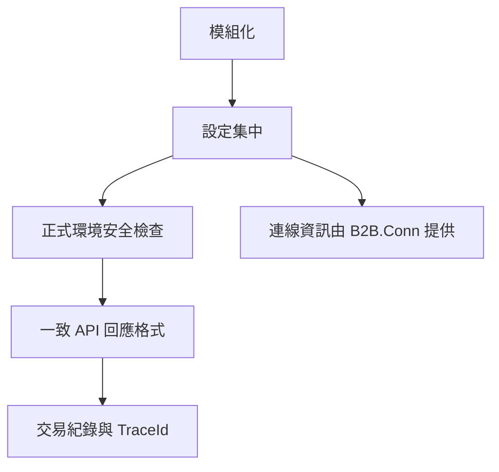

整體設計目標：

- 使用 Autofac Module 降低註冊邏輯散落。
- 使用 `B2B.Conn` 集中處理 AWS 離線環境的連線帳密解析。
- 讓 `appsettings.json` 不保存 Oracle 連線字串。
- 讓 WebApi 啟動時即檢查正式環境高風險設定。
- 讓 API 回應、例外處理、交易紀錄與健康檢查保持一致。
