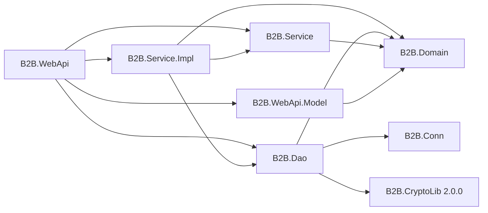
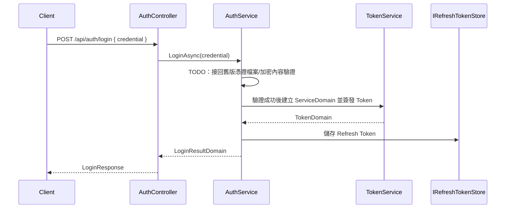

# B2B API

目前方案是以 .NET 10.0 建置的 ASP.NET Core Web API。方案保留原本的分層路徑，讓 .NET Framework 4.8 的商業邏輯可以依照既有邊界逐段搬移：

```text
WebApi → Service → DAO → Oracle
```

目前 DAO 的 `DbContext`、Entity、Mapping 與 Repository 已存在；User 查詢的 Service/WebApi 路徑已接通。登入憑證驗證仍保留在 `AuthService.LoginAsync` 的 TODO，驗證完成後才接回既有 JWT 簽發流程。

## 方案與版本

| 項目 | 現況 |
| --- | --- |
| 方案 | `B2B_API.sln` |
| Target Framework | 所有 `.csproj` 為 `net10.0` |
| Web API | `B2B.WebApi` |
| 測試 | `B2B.Tests`、xUnit |
| Solution Explorer | 根目錄 `README.md` 由 `B2B_API.sln` 的 `Solution Items` 顯示 |
| 版本控制 | 僅保留根目錄 README；專案資料夾內沒有 README |

## 目前版控檔案樹

以下是目前 Git 追蹤的方案與專案檔案。`bin`、`obj`、`.vs` 等建置或 IDE 產物不屬於版控內容。

```text
B2B_API/
├── .gitattributes
├── .gitignore
├── B2B_API.sln
├── README.md
├── B2B.Conn/
│   ├── B2B.Conn.csproj
│   ├── B2B_Conn.cs
│   ├── Configuration/
│   │   ├── ConnectionProfileProvider.cs
│   │   ├── DefaultConnectionProfiles.cs
│   │   └── TextNormalizer.cs
│   ├── Credentials/
│   │   ├── CredentialResolutionService.cs
│   │   ├── CredentialTextParser.cs
│   │   ├── IniCredentialStore.cs
│   │   ├── MonthCredentialSelector.cs
│   │   ├── OracleConnectionStringFormatter.cs
│   │   └── PasswordFormatter.cs
│   ├── Cryptography/
│   │   ├── AesStringProtector.cs
│   │   ├── KeySetProvider.cs
│   │   ├── RsaPrivateKeyDecryptor.cs
│   │   ├── Sha512Hasher.cs
│   │   ├── StringExtension.cs
│   │   └── SymmetricKeyProvider.cs
│   ├── Models/
│   │   ├── B2B_Connection.cs
│   │   ├── Entity_Connection.cs
│   │   ├── KeySetInfo.cs
│   │   ├── RsaKeyModel.cs
│   │   └── SymmetricKeyModel.cs
│   ├── Modules/B2BConnModule.cs
│   └── Options/B2BConnOptions.cs
├── B2B.Dao/
│   ├── B2B.Dao.csproj
│   ├── Contexts/B2BDbContext.cs
│   ├── Entities/UserEntity.cs
│   ├── Extensions/CryptoConfigurationExtensions.cs
│   ├── Mappings/
│   │   ├── PropertyBuilderEncryptionExtensions.cs
│   │   ├── UserEntityMapping.cs
│   │   └── UserEntityMappingExtensions.cs
│   ├── Modules/
│   │   ├── B2BDaoModule.cs
│   │   └── B2BDaoOptions.cs
│   └── Repositories/
│       ├── Implements/
│       │   ├── InMemoryUserRepository.cs
│       │   └── UserRepository.cs
│       └── Interfaces/IUserRepository.cs
├── B2B.Domain/
│   ├── B2B.Domain.csproj
│   ├── LoginResultDomain.cs
│   ├── RefreshTokenDomain.cs
│   ├── ServiceDomain.cs
│   ├── TokenDomain.cs
│   ├── UserFind.cs
│   ├── UserDomain.cs
│   └── Models/RefreshTokenModel.cs
├── B2B.Service/
│   ├── B2B.Service.csproj
│   ├── IAuthService.cs
│   ├── ITokenService.cs
│   ├── IUserService.cs
│   ├── Interfaces/IRefreshTokenStore.cs
│   └── Options/JwtOptions.cs
├── B2B.Service.Impl/
│   ├── B2B.Service.Impl.csproj
│   ├── Mappings/ServiceJwtClaimsExtensions.cs
│   ├── Modules/B2BServiceModule.cs
│   ├── Services/
│   │   ├── AuthService.cs
│   │   ├── TokenService.cs
│   │   └── UserService.cs
│   └── Stores/MemoryRefreshTokenStore.cs
├── B2B.WebApi.Model/
│   ├── B2B.WebApi.Model.csproj
│   ├── Auth/
│   │   ├── LoginRequest.cs
│   │   ├── LoginResponse.cs
│   │   ├── LogoutRequest.cs
│   │   ├── RefreshTokenRequest.cs
│   │   └── RefreshTokenResponse.cs
│   ├── Common/
│   │   ├── ApiResponse.cs
│   │   └── ErrorResponse.cs
│   └── User/UserResponse.cs
├── B2B.WebApi/
│   ├── B2B.WebApi.csproj
│   ├── B2B.WebApi.http
│   ├── Program.cs
│   ├── appsettings.json
│   ├── appsettings.Development.json
│   ├── appsettings.Production.json
│   ├── nlog.config
│   ├── Controllers/
│   │   ├── AuthController.cs
│   │   ├── HealthController.cs
│   │   └── UsersController.cs
│   ├── Extensions/
│   │   ├── ApplicationBuilderExtensions.cs
│   │   ├── AuthenticationExtensions.cs
│   │   ├── NLogExtensions.cs
│   │   ├── SecurityConfigurationValidator.cs
│   │   └── ServiceCollectionExtensions.cs
│   ├── Filters/ApiResponseTraceIdFilter.cs
│   ├── HealthChecks/OracleHealthCheck.cs
│   ├── Mappings/
│   │   ├── AuthResponseMapping.cs
│   │   └── UserResponseMapping.cs
│   ├── Middlewares/
│   │   ├── ExceptionHandlingMiddleware.cs
│   │   └── TransactionLogMiddleware.cs
│   ├── Modules/B2BWebApiModule.cs
│   ├── Options/
│   │   ├── B2BForwardedHeadersOptions.cs
│   │   ├── RateLimitOptions.cs
│   │   └── TransactionLogOptions.cs
│   └── Properties/launchSettings.json
└── B2B.Tests/
    ├── B2B.Tests.csproj
    ├── B2BWebApiFactory.cs
    ├── AuthApiTests.cs
    ├── AuthServiceTests.cs
    ├── CryptoIntegrationTests.cs
    ├── TestDoubles.cs
    ├── TokenServiceTests.cs
    ├── TransactionLogMiddlewareTests.cs
    └── UsersApiTests.cs
```

## 專案職責與相依

| 專案 | Target | 職責 | ProjectReference |
| --- | --- | --- | --- |
| `B2B.Conn` | `net10.0` | 連線 Profile、INI 密文、RSA/AES 金鑰與 Oracle 連線資料解析 | 無 |
| `B2B.Domain` | `net10.0` | `UserDomain`、`UserFind`、`ServiceDomain`、Token 與處理結果模型 | 無 |
| `B2B.Dao` | `net10.0` | EF Core `B2BDbContext`、`UserEntity`、Oracle/User Repository、CryptoLib field mapping | `B2B.Conn`、`B2B.Domain` |
| `B2B.Service` | `net10.0` | `IAuthService`、`IUserService`、`ITokenService`、Options 與 Store 介面 | `B2B.Domain` |
| `B2B.Service.Impl` | `net10.0` | Auth、JWT、User 查詢與 Refresh Token Store 實作 | `B2B.Service`、`B2B.Domain`、`B2B.Dao` |
| `B2B.WebApi.Model` | `net10.0` | API Request/Response DTO 與 `ApiResponse<T>` | `B2B.Domain` |
| `B2B.WebApi` | `net10.0` | Host、Controller、Middleware、JWT、Rate Limit、Swagger、Health Check | `B2B.Service`、`B2B.Service.Impl`、`B2B.WebApi.Model`、`B2B.Domain`、`B2B.Dao` |
| `B2B.Tests` | `net10.0` | xUnit、Web API Factory、Service/Controller/Middleware 測試 | `B2B.Domain`、`B2B.Service`、`B2B.Service.Impl`、`B2B.WebApi`、`B2B.WebApi.Model` |



`B2B.WebApi` 是 Composition Root，只註冊 `B2BWebApiModule`；該 Module 再載入 `B2BDaoModule` 與 `B2BServiceModule`。DAO 會載入 `B2BConnModule`，因此連線解析不需要在 `Program.cs` 重複註冊。

## Web API 啟動與 Middleware

`B2B.WebApi/Program.cs` 的實際順序如下：

1. 建立 `WebApplicationBuilder`，依 `Crypto:Enabled` 初始化可選的 CryptoLib default client，再切換 Autofac 與 NLog。
2. 呼叫 `AddB2BOptions`、`AddB2BAuthentication`、`AddB2BRateLimiting`、`AddB2BSwagger`。
3. `Build()` 後執行 `SecurityConfigurationValidator.Validate`。
4. 依序加入 Forwarded Headers（啟用時）、HSTS（非 Development）、安全標頭、例外處理、交易紀錄。
5. Development 才啟用 Swagger；接著啟用 HTTPS、Authentication、Authorization、Rate Limiter。
6. 映射 `/health/live`、`/health/ready` 與 Controller。

所有端點預設需要登入，`AuthController`、`HealthController` 與 Health Check 端點以 `[AllowAnonymous]` 或 `.AllowAnonymous()` 放行。

## 設定與外部檔案

### JWT

`B2B.WebApi/appsettings.json` 的目前結構：

```json
{
  "Jwt": {
    "Issuer": "B2B_API",
    "Audience": "B2B_API_CLIENT",
    "SecretKey": "",
    "AccessTokenMinutes": 60,
    "RefreshTokenDays": 7
  }
}
```

Repository 中的 `SecretKey` 保持空白；執行時必須由安全設定來源提供，且不可使用空白或預設佔位值。JWT 使用 HMAC-SHA256，Claims 由 `ServiceDomain` 轉換為 `sub` 與 `service_name`。

### DataAccess

```json
{
  "DataAccess": {
    "UseFakeRepositories": false,
    "B2BConn": {
      "EnvType": "TEST",
      "SvrType": "DEV",
      "DBType": "INET",
      "AccType": "ASI4"
    }
  }
}
```

Development 設定將 `UseFakeRepositories` 設為 `true`，使用 `InMemoryUserRepository`；Production 必須為 `false`，使用 Oracle `UserRepository`。DAO 會以 `B2B.Conn` 回傳的 `DataSource`、帳號與動態密碼組成 Oracle 連線字串。

### Database field encryption

`B2B.Dao` 以 `PackageReference` 依賴 `B2B.CryptoLib` 2.0.0。CryptoLib 不會由 runtime
自行讀取 `appsettings.json`；B2B API 只在 `Crypto:Enabled` 為 `true` 時，在啟動期間以
`builder.Environment.ContentRootPath` 為基準初始化一次 default client：

```json
{
  "Crypto": {
    "Enabled": false,
    "KeyManagerBasePath": "",
    "ActiveUnifiedName": ""
  }
}
```

啟用時 `KeyManagerBasePath` 與 `ActiveUnifiedName` 不可為空白。相對的
`KeyManagerBasePath` 會解析為 `<content-root>/<configured-path>`；絕對路徑則保持為絕對路徑。
金鑰目錄由 CryptoLib 管理，設定只放路徑與 active unified name，不放 AES key 或 RSA
private/public key。正常啟動只呼叫 `Crypto.Initialize`，不會自動執行
`Crypto.UpdateKeySetsAsync()`。

對確定不需要資料庫搜尋的敏感字串欄位，可在 DAO mapping 使用：

```csharp
entity.Property(x => x.SomeSensitiveValue)
    .HasColumnName("SENSITIVE_VALUE")
    .HasB2BEncryption()
    .IsRequired();
```

這個 extension 透過 EF Core `ValueConverter` 將明文轉為 CryptoLib 的
`Base64(payload).unifiedName` 格式，讀取時再還原明文。它只適合 storage/retrieval，不適合
`WHERE =`、`LIKE`、`Contains`、`StartsWith`、`EndsWith`、`JOIN`、依明文語意排序、唯一明文
約束或一般明文索引查找；CryptoLib 使用 randomized AES-GCM，同一明文每次密文都不同。
`NULL` 仍是 `NULL`，轉換器採 strict encrypted contract，不提供既有明文 fallback 或自動
遷移。AES-GCM envelope 與 Base64 會增加資料庫儲存長度，因此呼叫端必須明確管理
`HasMaxLength`/`ColumnType` 與 Oracle 欄位容量。

本次整合只建立 mapping infrastructure，不會替 `UserEntity.Account`、`DisplayName` 或
`PasswordHash` 加密，也不會新增 dummy 欄位、migration、DDL 或改變既有 User schema。這些欄位
目前分別依賴 equality/Contains/LIKE、搜尋語意或 password hash；若未來要支援可搜尋的加密
欄位，應另行設計 searchable encryption 或 blind index。既有 plaintext 欄位的轉換也應另開
migration 工作，不可在 converter 中猜測資料格式。

測試金鑰只放在測試暫存目錄；production key files、AES/RSA key material 與外部 key
directory 不可提交到 Git。正式部署仍需將 `B2B.CryptoLib.2.0.0.nupkg` 發布至 organization
或 offline NuGet source；repository 不依賴 sibling-folder `ProjectReference` 或 machine-specific
feed 設定。

### B2B.Conn 外部資料

`B2B.Conn` 預設讀取 `C:\B2B_Conn\`，實際檔案不在 Git：

```text
C:\B2B_Conn\
├── B2BConn1.ini
├── B2BConn2.ini
└── Other\
    ├── {8位英數}.der
    ├── {8位英數}.public.pem
    └── {8位英數}.private.pem
```

`KeySetProvider` 會在 `Other` 找到最新的一組完整金鑰。`.der` 包含 RSA 加密的 AES Key/IV，RSA 私鑰用 PKCS#1 解密，INI 內容再以 AES-CBC/PKCS7 解密。`IniCredentialStore` 依月份讀取 `B2BConn1.ini` 或 `B2BConn2.ini`，再由 `CredentialTextParser` 與 `PasswordFormatter` 產生資料庫密碼。

不要將外部 INI、RSA 私鑰、AES 金鑰、資料庫密碼或 JWT SecretKey 放入 Git 或交易 Log。

## DAO → Service → WebApi 路徑

User 查詢的現行路徑為：

```text
GET /api/users/{userId}
    → UsersController
        → IUserService
            → UserService
                → IUserRepository
                    → UserRepository / InMemoryUserRepository
                        → B2BDbContext → Oracle
```

使用者清單查詢使用 `B2B.Domain.UserFind` 作為可選條件：

```csharp
var users = await userRepository.GetListAsync(
    new UserFind
    {
        Account = "adm",
        IsActive = true
    },
    cancellationToken);
```

`UserFind` 的 `UserId`、`Account`、`DisplayName`、`IsActive`、`CreatedAtFrom` 與 `CreatedAtTo` 都是可選欄位。傳入 `null` 或空白條件物件時不套用篩選，直接回傳完整清單；文字條件採不分大小寫部分符合。

以 POST 取得多筆使用者的範例：

```http
POST /api/users/search
Content-Type: application/json

{
  "account": "adm",
  "isActive": true
}
```

`UsersController` 的路由：

| Method | Route | 行為 |
| --- | --- | --- |
| `POST` | `/api/users/search` | 透過 `IUserService.GetListAsync` 依 Body 條件查詢多筆使用者 |
| `GET` | `/api/users/{userId:long}` | 透過 `IUserService.GetByIdAsync` 查詢 |
| `GET` | `/api/users/by-account/{account}` | 透過 `IUserService.GetByAccountAsync` 查詢 |

Service 回傳 `UserDomain?`；Controller 將結果交給 `UserResponseMapping` 轉成 `UserResponse`。回應只包含 `UserId`、`Account`、`DisplayName`、`IsActive`、`CreatedAt`，不包含 `PasswordHash`。

目前手動遷移標記位於：

| 標記 | 檔案 | 用途 |
| --- | --- | --- |
| `TODO[MIGRATE-DAO]` | `B2B.Service.Impl/Services/UserService.cs` | 對照舊版 DAO 查詢條件與資料存取差異 |
| `TODO[MIGRATE-SERVICE]` | `B2B.Service.Impl/Services/UserService.cs` | 搬入啟用狀態、權限與其他商業規則 |
| `TODO[MIGRATE-CONTROLLER]` | `B2B.WebApi/Controllers/UsersController.cs` | 搬入舊版輸入、權限與 HTTP 行為 |
| `TODO[MIGRATE-RESPONSE]` | `B2B.WebApi/Controllers/UsersController.cs`、`B2B.WebApi/Mappings/UserResponseMapping.cs` | 搬入公開回應欄位 |
| `TODO[MIGRATE-SECURITY]` | `B2B.WebApi/Mappings/UserResponseMapping.cs` | 確認敏感欄位永不輸出 |

DAO 是本次遷移的固定邊界：搬移 Service 或 WebApi 時不要重建、改名或修改 `B2B.Dao` 的 Context、Entity、Mapping、Repository。

## 憑證驗證 → JWT 路徑

登入與 User 查詢是兩條獨立流程。登入不查詢 User Repository，也不以 `UserDomain` 作為 JWT 身分。



目前 `AuthService.LoginAsync` 會安全地回傳 `AUTHENTICATION_NOT_CONFIGURED`，直到舊版憑證驗證被搬入。完成驗證後，流程應為：

1. `AuthController` 只接收 `LoginRequest.Credential`，不可在 Controller 讀檔或直接簽 Token。
2. `AuthService.LoginAsync` 驗證呼叫端傳入的憑證內容。
3. 驗證成功後建立已驗證的 `ServiceDomain`。
4. 呼叫既有 `IssueTokenAsync`，由 `ITokenService` 產生 JWT 與 Refresh Token。
5. 由 `IRefreshTokenStore` 保存 Refresh Token。

API 請求模型為：

```json
{
  "credential": "<由離線環境提供的加密憑證內容>"
}
```

目前方案不包含 `Entry.ini` 與 `EntryCredentialValidator`；憑證檔案與加密內容的實際驗證接點只保留在 `AuthService.LoginAsync` TODO。

Refresh Token API：

| Method | Route | 行為 |
| --- | --- | --- |
| `POST` | `/api/auth/refresh-token` | Consume 舊 Refresh Token，驗證後輪替並簽發新 Token |
| `POST` | `/api/auth/logout` | 移除指定 Refresh Token |

Refresh Token 目前由 `MemoryRefreshTokenStore` 保存；行程重啟後狀態會消失。

## API 回應、安全與健康檢查

- Controller 使用 `ApiResponse<T>` 統一包裝成功、錯誤與 `TraceId`。
- Model validation 失敗會回傳 `VALIDATION_FAILED` 與欄位錯誤。
- `ExceptionHandlingMiddleware` 統一處理未捕捉例外。
- `TransactionLogMiddleware` 可記錄 TraceId、路徑、狀態碼與耗時；敏感欄位名稱由設定遮罩，Request/Response Body 預設不記錄。
- Auth API 套用 `RateLimiting:Auth`，預設每個 Client IP/User-Agent 每 60 秒 5 次，超過回傳 `429 RATE_LIMITED`。
- `/health/live` 只檢查行程存活；`/health/ready` 執行 `OracleHealthCheck`，檢查 `B2BDbContext.Database.CanConnectAsync`。
- 非 Development 啟動時會拒絕 Fake Repository、Request/Response Body Log，以及空白或 `*` 的 `AllowedHosts`；JWT SecretKey 永遠必須有效。

## .NET Framework 4.8 手動遷移步驟

### 1. 先確認固定邊界

只搬移 `B2B.Service`、`B2B.Service.Impl`，必要時再搬 `B2B.WebApi` 的 Controller/Mapping。`B2B.Dao` 不改，先比對 `IUserRepository` 的輸入、輸出與例外行為。

### 2. 搬移 User 商業邏輯

1. 將舊版 DAO 呼叫後的查詢規則接到 `UserService.GetByAccountAsync` 與 `GetByIdAsync` 的 `TODO[MIGRATE-DAO]` / `TODO[MIGRATE-SERVICE]`。
2. Service 只回傳 `UserDomain?`，不要建立或回傳 `UserResponse`。
3. 將舊版 Controller 的輸入格式、權限與 HTTP 行為接到 `UsersController` 的 `TODO[MIGRATE-CONTROLLER]`。
4. 將公開欄位接到 `UserResponseMapping` 的 `TODO[MIGRATE-RESPONSE]`，並依 `TODO[MIGRATE-SECURITY]` 排除密碼雜湊與其他敏感資料。

### 3. 搬移憑證驗證與 JWT

1. 在 `AuthService.LoginAsync` 的 TODO 接回舊版憑證檔案、加密內容解析與比對。
2. 驗證成功後建立 `ServiceDomain`，不要建立 `UserDomain` 或查詢 User Repository。
3. 呼叫 `IssueTokenAsync`，保留 `TokenService`、`MemoryRefreshTokenStore`、Refresh Token 輪替與 Logout 行為。
4. `AuthController` 只負責請求模型、服務呼叫與回應映射；舊版額外回應欄位接到現有 Controller/Mapping TODO。
5. 不要把真正密文、金鑰、密碼或 JWT SecretKey 提交到 Git。

### 4. 每次搬移後檢查

```powershell
dotnet restore B2B_API.sln
dotnet build B2B_API.sln --no-restore
dotnet test B2B_API.sln --no-restore --verbosity minimal
rg -n "TODO(\[MIGRATE-[A-Z-]+\])?" B2B.Service B2B.Service.Impl B2B.WebApi
git diff --check
git diff --name-only -- B2B.Dao
```

最後一個指令應沒有輸出。若 `B2B.Dao` 出現差異，先停止搬移並確認是否誤改固定資料存取邊界。測試環境可使用 `UseFakeRepositories=true`；實際 Oracle、外部金鑰與完整 JWT 登入流程仍需在對應環境驗證。

## Visual Studio 方案總管

`B2B_API.sln` 的 Solution Items 會指向根目錄 `README.md`：

```text
方案
└── Solution Items
    └── README.md
```

因此在 Visual Studio 2026 開啟 `B2B_API.sln` 後，可以直接從方案總管開啟根目錄 README。專案資料夾內不再放置重複 README。

## 本機執行與測試

```powershell
dotnet restore B2B_API.sln
dotnet build B2B_API.sln --no-restore
dotnet test B2B_API.sln --no-restore --verbosity minimal
dotnet run --project B2B.WebApi/B2B.WebApi.csproj
```

Development 啟動會使用記憶體 User Repository，但仍需要測試用 JWT SecretKey；若要使用實際 Oracle，請提供 `C:\B2B_Conn` 外部檔案、關閉 Fake Repository，並確認 `/health/ready` 通過。
